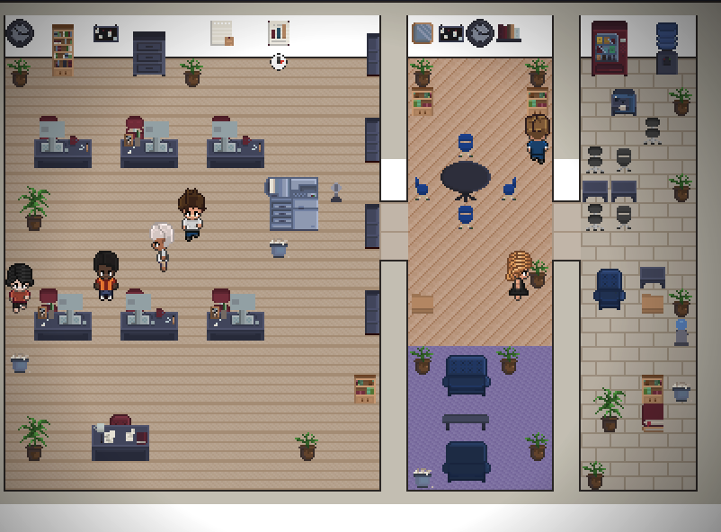
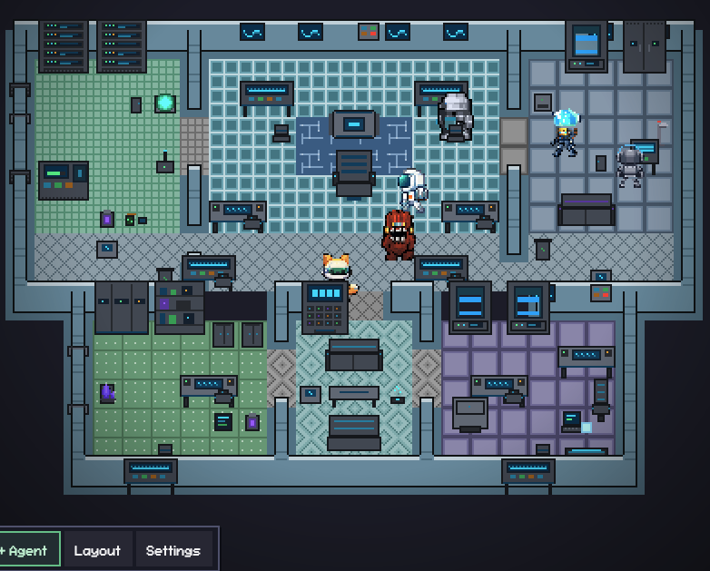
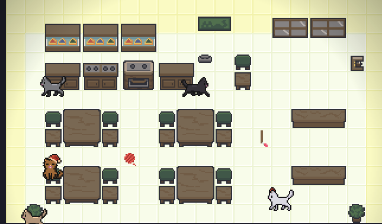

# Pixel Office - AI Agent Visualizer

An IntelliJ plugin that turns your Claude Code terminal sessions into animated pixel art characters in a virtual office.

Each Claude Code terminal you open spawns a character that walks around, sits at desks, and visually reflects what the agent is doing — typing when writing code, reading when searching files, waiting when it needs your attention.

Ported from [Pixel Agents for VS Code](https://github.com/pablodelucca/pixel-agents) by Pablo De Lucca, with additional features for the IntelliJ Platform.

## Themes

### Office (Default)


### Alien (UFO)


### Cat Cafe


## Features

- **One agent, one character** — every Claude Code terminal gets its own animated character
- **Live activity tracking** — characters animate based on what the agent is actually doing (writing, reading, running commands)
- **Sub-agent visualization** — Task/Agent sub-agents spawn as separate characters, including async background agents with independent JSONL tracking
- **Office layout editor** — design your office with floors, walls, and 80+ furniture items
- **Multiple themes** — default office, alien, and cat themes with unique characters and furniture
- **Speech bubbles** — visual indicators when an agent is waiting for input or needs permission
- **Sound notifications** — optional chime when an agent finishes its turn
- **Animated furniture** — wall clocks tick, desk fans spin, water coolers bubble
- **Persistent layouts** — your office design is saved across IDE restarts
- **External session adoption** — automatically detects Claude Code sessions started outside the plugin
- **Diverse characters** — 6 unique characters per theme with automatic palette diversity for sub-agents
- **5-hour usage in the HUD** — shows your real 5-hour plan usage (`5h 14%`) when Claude Code's status line or Claude Desktop reports it, otherwise the weighted token count of the last 5 hours (`23.4M / 5h`)
- **Fits narrow windows** — the bottom HUD drops detail step by step instead of overlapping the toolbar

## Requirements

- IntelliJ IDEA 2024.2+ (or any JetBrains IDE based on IntelliJ Platform 2024.2+)
- [Claude Code CLI](https://docs.anthropic.com/en/docs/claude-code) installed and configured
- JBR (JetBrains Runtime) with JCEF support (included by default)

## Installation

### From JetBrains Marketplace

Search for **Pixel Office** in Settings > Plugins > Marketplace.

### From ZIP

1. Download the latest `pixel-agents-intellij-x.x.x.zip` from [Releases](https://github.com/ngh96759788-coder/pixel-agents-intellij/releases)
2. Settings > Plugins > Gear icon > Install Plugin from Disk
3. Select the ZIP file and restart the IDE

## Usage

1. Open the **Pixel Agents** tool window (bottom panel)
2. Click **+ Agent** to spawn a new Claude Code terminal and its character
3. Start coding with Claude — watch the character react in real time
4. Click a character to select it, then click a seat to reassign it
5. Click **Layout** to open the office editor and customize your space

## Layout Editor

The built-in editor lets you design your office:

- **Floor** — 7 patterns with full HSBC color control
- **Walls** — Auto-tiling walls with color customization
- **Furniture** — 80+ items across desks, chairs, electronics, decor, and wall items
- **Tools** — Select, paint, erase, place, eyedropper, pick
- **Undo/Redo** — 50 levels with Ctrl+Z / Ctrl+Y
- **Export/Import** — Share layouts as JSON files via the Settings modal

The grid is expandable up to 64x64 tiles. Click the ghost border outside the current grid to grow it.

## Building from Source

### Prerequisites

- JDK 21+
- Node.js (LTS recommended)
- Gradle (wrapper included)

### Build

```bash
git clone https://github.com/ngh96759788-coder/pixel-agents-intellij.git
cd pixel-agents-intellij

# Build webview (must run before Gradle)
cd webview-ui && npm install && npm run build && cd ..

# Build plugin
./gradlew buildPlugin
```

The plugin ZIP will be at `build/distributions/pixel-agents-intellij-x.x.x.zip`.

### Development

```bash
# Run the IDE with plugin loaded for testing
./gradlew runIde
```

Or open the project in IntelliJ IDEA and use the pre-configured Run Configuration.

### Tests

```bash
# Webview unit tests
cd webview-ui && npx vitest run

# Binary compatibility against the target IDEs (downloads several GB)
./gradlew verifyPlugin
```

### Releasing

Bump `pluginVersion` in `gradle.properties`, add a matching `## <version>` section
to `CHANGELOG.md`, then push a tag:

```bash
git tag v1.0.6 && git push origin v1.0.6
```

`.github/workflows/release.yml` builds the webview, runs the tests, verifies binary
compatibility against every target IDE, publishes to JetBrains Marketplace, and
creates a GitHub Release with the ZIP attached. The tag must match `pluginVersion`
or the run fails before publishing anything.

Repository secrets:

| Secret | Required | Purpose |
| --- | --- | --- |
| `PUBLISH_TOKEN` | yes | Marketplace upload — create at [plugins.jetbrains.com/author/me/tokens](https://plugins.jetbrains.com/author/me/tokens) |
| `SIGNING_CERTIFICATE_CHAIN` | no | Certificate chain (PEM contents) |
| `SIGNING_PRIVATE_KEY` | no | Private key (PEM contents) |
| `SIGNING_PASSWORD` | no | Private key password |

Without the signing secrets the plugin is published unsigned, which Marketplace
accepts. See [Plugin Signing](https://plugins.jetbrains.com/docs/intellij/plugin-signing.html).

**Compatibility note:** the plugin declares no `until-build` upper bound, so it stays
listed as new IDEs ship. Nothing checks the newest IDE except `verifyPlugin` — when a
platform release does break something, add the failing build to the verifier list and
fix it, rather than re-capping `untilBuild` and silently dropping every user.

## How It Works

Pixel Agents watches Claude Code's JSONL transcript files at `~/.claude/projects/<project-hash>/` to track what each agent is doing. When an agent uses a tool (like writing a file or running a command), the plugin detects it and updates the character's animation accordingly. No modifications to Claude Code are needed — it's purely observational.

For async sub-agents (background Agent tool), the plugin also monitors separate JSONL files at `<session-id>/subagents/agent-<id>.jsonl` to track their independent tool activity.

The webview runs a lightweight game loop with canvas rendering, BFS pathfinding, and a character state machine (idle -> walk -> type/read). Everything is pixel-perfect at integer zoom levels.

## 5-Hour Usage

The HUD's 5h chip uses the first available of:

1. **Claude Code status line** — Claude Code passes `rate_limits` (5-hour and 7-day usage, Pro/Max plans) to your status line script. Add this to the script so Pixel Office can read it (requires `jq`):

   ```bash
   input=$(cat)   # skip if your script already reads stdin into a variable
   rl=$(echo "$input" | jq -c 'select(.rate_limits.five_hour.used_percentage != null) | {updatedAt: (now * 1000 | floor), fiveHour: {usedPercentage: .rate_limits.five_hour.used_percentage, resetsAt: .rate_limits.five_hour.resets_at}, sevenDay: (.rate_limits.seven_day // null | if . then {usedPercentage: .used_percentage, resetsAt: .resets_at} else null end)}')
   if [ -n "$rl" ]; then mkdir -p "$HOME/.pixel-agents" && printf '%s' "$rl" > "$HOME/.pixel-agents/rate-limits.json"; fi
   ```

   A reading stays valid until its 5-hour window resets.
2. **Claude Desktop** — Desktop records usage samples every 15 minutes in its own `plan-usage-history.json`; a sample up to 20 minutes old is used. When both sources are valid, the more recent one wins.
3. **Fallback** — the weighted token sum of the last 5 hours from `~/.claude/projects` (cache reads 0.10x, cache writes 1.25x).

The chip reads like `5h 14% · 7d 23% (pace 35%)`. **Pace** is where 7-day usage would be now if the week's limit were spread evenly over its weekday hours (weekends add nothing). The chip turns amber when 7-day usage is ahead of the pace. Pace needs the 7-day reset time, which only the status line provides, so a Desktop-only reading shows `5h · 7d` without it. Hover the chip for the reset times and the source.

**Optional: let Claude see it too.** `hooks/usage-pace.py` is a Claude Code `UserPromptSubmit` hook that reads the same cache and adds one line to your message only while 7-day usage is ahead of the pace (otherwise it adds nothing, so it costs no tokens). Copy it to `~/.claude/hooks/` and add to `~/.claude/settings.json`:

```json
{ "hooks": { "UserPromptSubmit": [ { "hooks": [ { "type": "command", "command": "python3 $HOME/.claude/hooks/usage-pace.py", "timeout": 5 } ] } ] } }
```

## Tech Stack

- **Plugin**: Kotlin, IntelliJ Platform SDK, JCEF (Chromium Embedded Framework)
- **Webview**: React 19, TypeScript, Vite, Canvas 2D

## Office Assets

The office tileset is [Office Interior Tileset (16x16)](https://donarg.itch.io/officetileset) by **Donarg** on itch.io. This tileset is not included in the repository due to its license. The plugin works without it using built-in default assets. To use the full furniture catalog, purchase the tileset and run the asset import pipeline:

```bash
npm run import-tileset
```

## Attribution

This project is an IntelliJ Platform port of [Pixel Agents](https://github.com/pablodelucca/pixel-agents) by [Pablo De Lucca](https://github.com/pablodelucca), originally built as a VS Code extension. The core concepts — JSONL transcript watching, pixel art office rendering, character state machine — originate from the original project.

### Theme assets

| Theme | Floor / wall / furniture sprites | Character sprites |
|---|---|---|
| `default` (office) | [Office Interior Tileset (16x16)](https://donarg.itch.io/officetileset) by Donarg (purchase required, not bundled) | Original — adapted from upstream Pixel Agents |
| `alien` | Custom pixel art for this project | Custom pixel art for this project |
| `cat` (cat cafe) | Custom pixel art for this project | Custom pixel art for this project |
| `zoo` | Custom pixel art for this project | Custom pixel art for this project |

Custom-themed assets were created specifically for this fork and are released under the same MIT license as the rest of the source. The `default` office tileset is third-party and must be purchased from itch.io to use the full furniture catalog; the plugin ships with reduced built-in defaults so it remains functional without it.

### Fonts

The pixel UI font is **FS Pixel Sans** (bundled at `webview-ui/src/fonts/`). Refer to that directory for the exact license terms.

## Contributing

See [CONTRIBUTORS.md](CONTRIBUTORS.md) for instructions on how to contribute.

Please read our [Code of Conduct](CODE_OF_CONDUCT.md) before participating.

## License

This project is licensed under the [MIT License](LICENSE).
